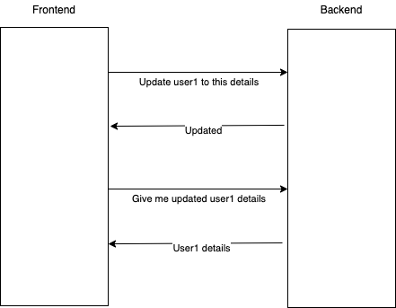
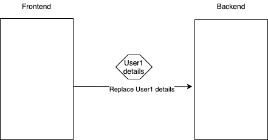

Rest API General Guidelines
________

# Table of contents

* [Main idea](#main-idea)
* [Best Practices](#best-practices)

## Main idea
The main idea on Rest API is that, parties communicate by sharing their current state instead of calling some action

Legacy APIs

When you want to call backend or some application you call some action in server, so you cannot predict what the outcome will be, you need to ask from server what is its new state, what happened after your action

One of the main problem here is that, you need to have lots of DTOs, mapping and lots of duplicates which can fail easily (userUpdateRequest, userUpdateResponse, userGetRequest, userGetResponse, etc.)

New APIs

The main idea in Rest API is you transfer your current state, so instead of calling some action on backend, frontend is sharing current state about user1 with backend, in other word, frontend is replacing user1 state in backend with its own state

When we use Rest API we will operate all operations as CRUD operation, it will help us to cut down features to well-designed CRUD operations, better to understand by API users, better abstraction

## Best Practices

### Don't write as Restful, Think as Restful

How to think as restful?
1. API's abstraction should be different its implementation, if you want to write better API don't try to represent your backend logic as is, instead think how API may be better to use by its clients
2. Try to be proactive, don't try to translate legacy API's OR SOAP style to simply to REST API, try to be proactive, think that how this API should be easy to use, how can I make it like a CRUD
3. Everything is CRUD

### Use nouns instead of verbs in endpoint paths
Why Nouns not verbs

* Noun reminds us actions not resource e.g. GET /getUserById  OR GET /users/1  in first call we are executing action, in second call we ar just reading some user resource from server
* As we say everything is CRUD, you need to have something (and it is a noun), you are doing CRUD operations on it

